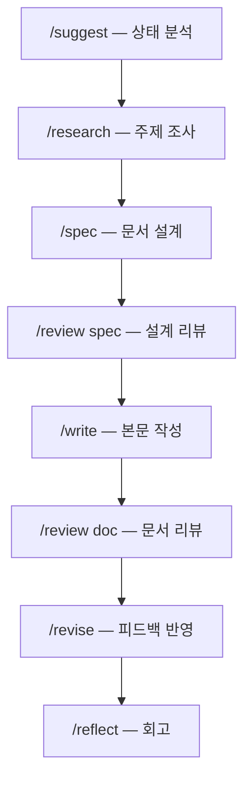

import { Callout, Steps, Tabs } from 'nextra/components'

# 스킬 개요

Ouroboros Document Workflow는 문서 작성 전 과정을 커버하는 **12개 스킬**을 제공합니다.

---

## 전체 스킬 목록

| # | 스킬 | 분류 | 용도 |
|---|------|------|------|
| 1 | `/draft` | Core | 1-2페이지 간단 문서 즉시 작성 |
| 2 | `/spec` | Core | 문서 구조 설계, 5-Tier 복잡도 분석, 목차 생성 |
| 3 | `/write` | Core | spec 기반 섹션별 본문 작성 |
| 4 | `/revise` | Core | 피드백 반영, 문서 개선 |
| 5 | `/review` | Core | 전문가 패널 리뷰 (논리, 근거, 가독성) |
| 6 | `/research` | Core | 주제 조사, 데이터 수집, 참고자료 정리 |
| 7 | `/consult` | On-demand | 특정 분야 전문가 자문 |
| 8 | `/suggest` | On-demand | 현재 상태 분석, 다음 액션 추천 |
| 9 | `/reflect` | Periodic | 회고, 인사이트 메모리 저장 |
| 10 | `/onboarding` | Periodic | 프로젝트/사용자 선호 동기화 |
| 11 | `/housekeeping` | Periodic | 메모리 정리, stale 검증 |
| 12 | `/guide` | On-demand | 워크플로우 가이드 표시 |

---

## 표준 워크플로우

---

## 스킬 선택 가이드

<Callout type="info">
  무엇을 해야 할지 모르겠으면 **`/suggest`**를 실행하세요.
</Callout>

| 상황 | 추천 스킬 |
|------|----------|
| 간단한 메모/이메일 | `/draft` |
| 본격적인 보고서 작성 | `/research` → `/spec` → `/write` |
| 작성된 문서 개선 | `/revise` 또는 `/review` |
| 주제에 대해 조사 필요 | `/research` |
| 전문가 의견이 필요 | `/consult` |
| 다음 할 일을 모르겠음 | `/suggest` |
